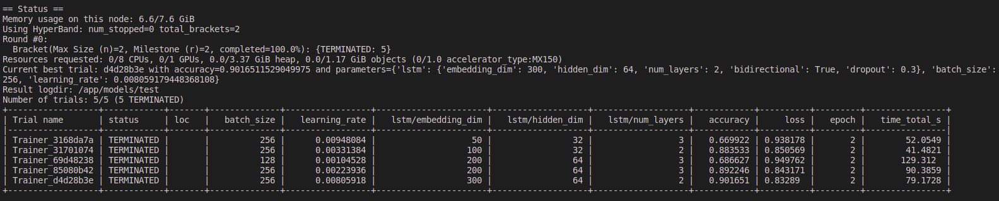

# Automatic Hyperparameter Optimization

A Demo on Automatic Hyperparameter Optimization algorithms like Grid search, Random search, Hyperband AND BOHB.

Tuning is performed for topic classification task on AG News dataset. The examples news belong to any of the four classes,
* World
* Sports
* Business
* Science-Technology

The dataset has 127600 examples, which is preprocessed and split into 3 for training(96000), validation(20000) and testing(7600). 
For more information, please refer to the link http://www.di.unipi.it/~gulli/AG_corpus_of_news_articles.html .

The AG's news topic classification dataset is constructed by Xiang Zhang (xiang.zhang@nyu.edu) from the dataset above. It is used as a text classification benchmark in the following paper: Xiang Zhang, Junbo Zhao, Yann LeCun. Character-level Convolutional Networks for Text Classification. Advances in Neural Information Processing Systems 28 (NIPS 2015).


Demo includes LSTM and BiLSTM architectures for topic classification. GloVe word vectors are used as dense word embeddings.

Each run of any search algorithm is called an Experiment, and each experiment involves multiple Trials. A single hyperparameter configuration is evaluated in one Trial by measuring accuracy on validation set. The demo is built using **ray.tune** library and the terminologies are adopted from the library.


## Getting Started
The demo is designed to be used with docker. Build a docker container with the command
```docker build -t demo .```

To create a container with gpu access, do
```docker run -it --gpus all -v /path-to-embeddings/embeddings:/ahpo/embeddings --name demo-image demo```

To create a container without gpu access, do
```docker run -it -v /path-to-embeddings/embeddings:/ahpo/embeddings --name demo-image demo```

By default, the demo uses Hyperband search algorithm. To run the demo, use the following command:

```python3 main.py```

To tune using other algorithms use option `-s` or `--search` with arguments `grid`, `random`, `hyperband` or `bohb`.

```python3 main.py -s grid```

The demo output status of tuning every few seconds (if execution takes longer then status is delayed) and finally the configuration that maximizes accuracy:


## Hyperparamters being tuned

Here is a list of hyperparameters that may be tuned in demo
1. `embedding_dim`
   The dimension of GloVe word embeddings to use. Allowed values include 50, 100, 200 and 300.
2. `hidden_dim`
   The number of features in the LSTM hidden state.
3. `num_layers`
   The number of recurrent layers of LSTMs.
4. `bidirectional`
   A flag to specify the use of Bidirectional LSTM. Takes boolean value (True or False)
5. `dropout`
   Probability of excluding input and recurrent connections of LSTM units.
6. `batch_size`
   Number of training examples utilized in one iteration of Adam optimizer
7. `learning_rate`
   A quantity to control step size towards a minima of loss function at each iteration of Adam optimizer.

## Configuring Search Space

A default minimal hyperparameter search space has already been defined on the `config.yaml` file in outermost project directory for the purpose of demo. To find the default search space used in the demo for a search algorithm, try:
```make help-<algorithm>```

Replace `<algorithm>` with `grid`, `random`, `hyperband` or `bohb`.


### Custom Search Space


Each tunable hyperparameter is listed under `HYPERPARAMETERS` section in `config.yaml`. Each hyperparameter has 3 keys `distribution`, `args` and `grid` which can be used to define a custom search space. Here is how to provide values to the keys.

1. **Grid Search**
    Grid search only uses the `grid` key. It takes a scalar or a list as value. The given value will be used to construct a set of values that a hyperparameter may take.

    An example for scalar value

    ```
    embedding_dim:
        grid: 50
    ```

    An example for proving a list as value
   
    ```
    embedding_dim:
        grid: [50, 100, 200, 300]
    ```
2. **Random, Hyperband and BOHB**
    Unlike Grid Search, other search algorithms checks the `distribution` and `args` key. The `distribution` key is used to define a distribution over the domain of a hyperparameter for random sampling. Based on the characteristics of the distribution, the arguments ie. `args` changes. Given below are the list of distributions accepted and their corresponding argument formats.

    | distribution  |argument	                 |description	|
    |---	        |---	                     |---	|
    |`uniform`      |`[lower, upper]`  	         |Sample a float uniformly between `lower` and `upper`  	                                    |
    |`loguniform`   |`[lower, upper]`   	     |Sample a float uniformly between `lower` and `upper`, while sampling in log space          |
    |`randn`        |`[mean, std]`  	         |Sample a random float from a normal distribution with `mean` and `std`                     |
    |`randint`      |`[lower, upper]`   	     |Sample a integer uniformly between `lower` (inclusive) and `upper` (exclusive).   	        |
    |`choice`       |`[a, b, [c,[d,...]]]`    	 |Sample a value uniformly from the specified list of choices   	                        |
    |`grid`         |`[a, b, [c,[d,...]]]`       |Do a grid search over these values for every random sample of other hyperparameters.   |
    |`quniform` 	|`[lower, upper, increment]` |Sample a float uniformly between `lower` and `upper`, rounding to increments of `increment` 	|
    |`qloguniform`	|`[lower, upper, increment]` |Sample a float uniformly between `lower` and `upper`, while sampling in log space, rounding to increments of `increment`|
    |`qrandn`	    |`[mean, std, increment]`    |Sample a random float from a normal distribution with `mean` and `std`, rounding to increments of `increment`|
    |`qrandint`	    |`[lower, upper, increment]` |Sample a integer uniformly between `lower` (inclusive) and `upper` (exclusive), rounding to increments of `increment`|

    Argument of any distribution is a list with length of 2 atleast. If a scalar is provided the distribution is ignored and the hyperparameter is simply initialized with the provided scalar. Example for configuring search space looks like,

    ```
    learning_rate:
        distribution: loguniform
        args: [0.001, 0.01]
    ```

## Configuring Experiment
 
 Similar to the search space, the experiment settings can also be customized. By default, the number of random sampling, `num_samples` is set to 5 for the purpose of demo. The metrics collected for every trial are validation 'accuracy' and validation 'loss', but the best configuration is selected using only the validation accuracy.

 The maximum number of epochs, `max_epoch` is set to 2 by default. Random Search will always execute every trial till `max_epoch`. But Hyperband and BOHB uses its early stopping feature to prune configurations based on performance metrics and resource allocation. The maximum resource per trial is automatically set by the program based on `max_epoch`.

## Configuring Hyperband and BOHB

Hyperband first runs every trial a minimum number of epochs before early stopping, which is set by `grace_period`. The `grace_period` by default is set to 1. The rate of downsampling, `reduction_factor` is set to to 3, ie 1/3rd of trials are stopped at each round of downsampling. Behind the scenes, the actual algorithm used for hyperband search in demo is Asynchronous Hyperband for its better parallelism and masks as a scheduler managing trials based on resources.

For BOHB as well the `reduction_factor` is set to 3. BOHB **doesn't** include the feature to incorporate `grace_period`. This is because BOHB is implemented leveraging standard Hyperband (masking as a resource scheduler) coupled with TPE(a variant of Bayesian Optimization) for sampling.


